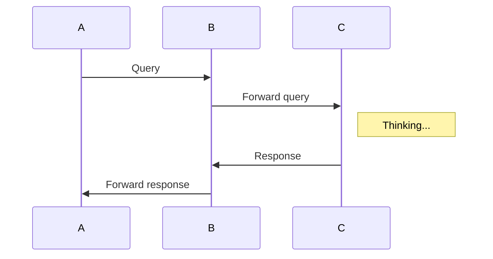

## mermaid 4 github pages


[https://github.com/Redisrupt/mermaid-diagrams](https://github.com/Redisrupt/mermaid-diagrams)

[https://github.com/jasonbellamy/jekyll-mermaid](https://github.com/jasonbellamy/jekyll-mermaid)

```markdown
sequenceDiagram
  A->> B: Query
  B->> C: Forward query
  Note right of C: Thinking...
  C->> B: Response
  B->> A: Forward response
```




